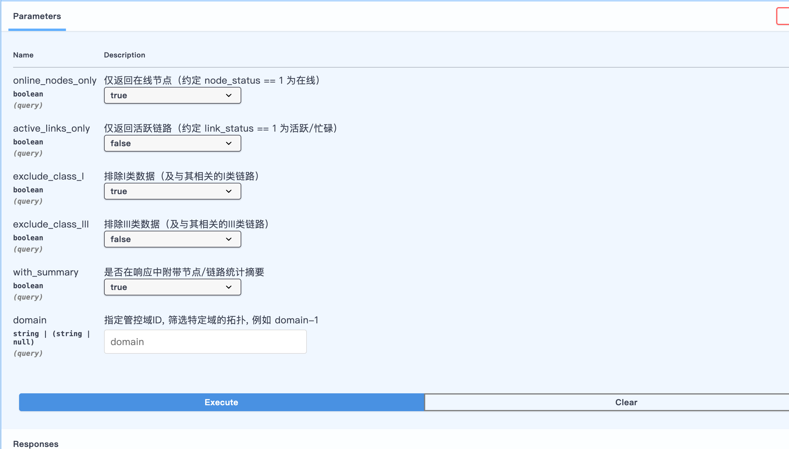

# 三维态势展示总体设计

这是一个刚创建的空的vue项目，用于在浏览器中展示仿真过程的三维态势信息。主要包括三维地图数据和节点目标信息数据。


## 加载三维地图

三维地图是tileset.json管理的*.b3dm，通过CesiumJS来加载展示。

三维地图服务地址：`"http://192.168.233.1:8080/3DTILES/tileset.json"`

这个地址应该做成可以配置的，而不是硬编码的。


## 获取目标信息数据

通过GET接口获取目标数据 `http://192.168.2.1:8000/api/v1/network/topology/query?online_nodes_only=true&active_links_only=false&exclude_class_I=false&exclude_class_III=false&with_summary=true`

5秒主动请求一次获取数据，接口地址和周期都做成可以配置的。

接口参数说明 

暂时可以先不管接口的参数，直接按照上面的链接获取信息即可。接口返回的payload json为 `./res.json`


## res.json 简要说明

- code: 返回0表示上报有效，返回非0值表示出现错误。

- data->topo->node: 节点目标列表。其中每个节点需要解析的属性有：

    - node_id：节点目标唯一id
    - node_type：节点目标类型：1=一类设备终端，2=一类设备簇头，3=二类设备车载，4=二类设备接入，5=二类设备骨干，6=Ⅳ类设备网关，7=二类设备-台式机，8=III类设备
    - node_status：节点状态: 0-离线,1-在线，link_status，链路状态: 0-离线,1-活跃
    - node_location：节点目标的经度，纬度和高度，通过`,`分隔的浮点数，有时候没有高度，那么默认为0
    - node_manage_ip_addr：节点的ip地址

- data->topo->link：节点之间的链路信息列表。其中每条链路需要解析的属性有：

    - link_id：每条链路的唯一id
    - link_status：链路状态: 0-离线,1-活跃
    - "src"->"src_node"：链路的发起节点id（也就是节点的node_id）
    - "dst"->"dst_node"：链路的目标节点id（也就是节点的node_id）

- summary->node_count：节点目标总数。用于验证节点目标列表数量是否一致。

- link_count：链路总条数。用于验证链路列表数量是否一致。


## 需要展示的信息

1. 目标类型图标。有8种目标类型，每种类型使用一个小的立体图形表示，比如球、三面体、正方体、圆柱等，而且需要使用不同的颜色。
2. 目标实时位置。根据json中目标的经纬高，将目标绘制到界面上。
3. 目标历史轨迹。存储目标的历史位置信息，每个目标最多720个点（也做成可以配置的）。根据目标的颜色绘制目标的历史轨迹。
4. 节点之间链路信息。每条链路是连接2个节点目标，如果链路是活跃的，绘制一条绿色的虚线。
5. 节点目标是可以选中的，选中目标的时候，在目标附近显示一个标牌，标牌里面显示节点的状态、位置、ip地址信息。标牌的右上角有关闭按钮，或者右键标牌关闭。
6. 目标和标牌之间通过目标图标相同颜色的细线相连。标牌可以拖动到不同位置。
7. 在界面的右上角需要显示`目标类型图标`图例信息，告诉用户每种图标代表什么类型的目标。如：
    ```
    球-一类设备终端
    三面体-一类设备簇头
    正方体-二类设备车载
    圆柱-二类设备接入
    ...
    ```


## 一些想法和问题

1. 目标类型图标。最好是从本地资源目录加载无色的三维图标，通过配置设定不同类型目标的颜色，这样用户可以方便修改不同类型目标的展示。
    但是我不确定怎么生成本地的三维图标资源，或者可以从哪里获取这类资源。

2. 在实现过程中函数参数传递过程中，尽量传完整的目标信息，后续很多地方还需要用到目标的各项属性。


## To Codex

根据这份文档和现有代码框架，仔细思考还有什么问题，我们先进行讨论，讨论完成之后再生成详细的技术方案，输出到001-final.md