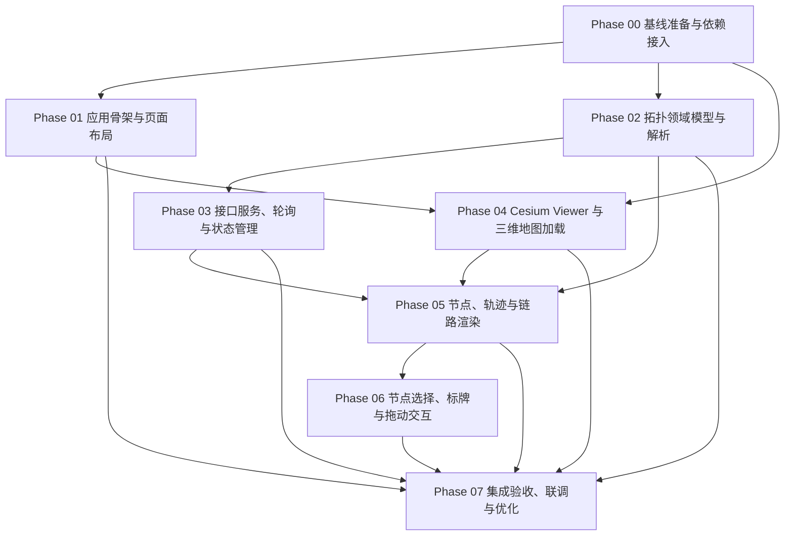

# 三维态势展示开发步骤索引

## 1. 文档目的

本文档是三维态势展示项目的总体开发步骤索引，基于 `plan/001-总体设计/001-final.md` 拆分可执行阶段。每个阶段的详细计划位于 `phases/` 目录，阶段内包含实现思路、新增文件、待办条目、前置依赖和验收重点。

## 2. 状态定义

| 状态   | 含义                                 |
| ------ | ------------------------------------ |
| 未开始 | 尚未进入实现。                       |
| 进行中 | 已开始实现，但尚未完成阶段验收。     |
| 已完成 | 代码、测试、构建和阶段验收均通过。   |
| 阻塞   | 存在外部依赖或关键问题，需要先澄清。 |

## 3. 阶段索引

| 阶段     | 名称                         | 状态   | 主要目标                                                                         | 详细计划                            | 直接依赖                     |
| -------- | ---------------------------- | ------ | -------------------------------------------------------------------------------- | ----------------------------------- | ---------------------------- |
| Phase 00 | 基线准备与依赖接入           | 已完成 | 接入 Cesium 依赖、建立环境配置、更新模板测试基线。                               | [phase-00.md](./phases/phase-00.md) | 无                           |
| Phase 01 | 应用骨架与页面布局           | 已完成 | 建立态势页面、路由、基础布局、图例和状态栏静态结构。                             | [phase-01.md](./phases/phase-01.md) | Phase 00                     |
| Phase 02 | 拓扑领域模型与解析           | 已完成 | 定义后端原始类型、前端归一化模型、坐标解析和数量校验。                           | [phase-02.md](./phases/phase-02.md) | Phase 00                     |
| Phase 03 | 接口服务、轮询与状态管理     | 已完成 | 实现拓扑请求、非重叠轮询、Pinia 状态和错误状态。                                 | [phase-03.md](./phases/phase-03.md) | Phase 02                     |
| Phase 04 | Cesium Viewer 与三维地图加载 | 已完成 | 初始化 Viewer、加载 3D Tiles、处理生命周期和资源路径。                           | [phase-04.md](./phases/phase-04.md) | Phase 00, Phase 01           |
| Phase 05 | 节点、轨迹与链路渲染         | 已完成 | 增量渲染节点、历史轨迹和活跃链路。                                               | [phase-05.md](./phases/phase-05.md) | Phase 02, Phase 03, Phase 04 |
| Phase 06 | 节点选择、标牌与拖动交互     | 已完成 | 实现节点点击选择、HTML 标牌、关闭、右键关闭、拖动和 SVG 连接线。                 | [phase-06.md](./phases/phase-06.md) | Phase 05                     |
| Phase 07 | 集成验收、联调与优化         | 已完成 | 完成测试、构建、测试拓扑服务联调和性能风险记录；生产真实接口仍需按部署环境复测。 | [phase-07.md](./phases/phase-07.md) | Phase 01 至 Phase 06         |

## 4. 依赖关系图

## 5. 推荐执行原则

- 严格按阶段推进，除 Phase 01 和 Phase 02 可并行外，其余阶段应等待直接依赖完成。
- 每个阶段先补测试或可验证夹具，再实现功能，避免只靠浏览器目测验收。
- Cesium 相关逻辑尽量封装到 composable，单测中通过 mock 验证调用，不在 jsdom 中强跑 WebGL。
- 所有函数声明处添加中文注释；复杂实现逻辑只添加必要中文注释，避免注释噪音。
- 对后端响应字段层级保持严格一致：`summary` 与 `code`、`data` 同级，不是 `data.summary`。

## 6. 总体完成标准

- 根路径进入三维态势展示页面。
- 能从配置读取三维瓦片地址、拓扑接口地址、轮询周期和历史轨迹点数。
- 能加载 3D Tiles，并持续拉取拓扑数据。
- 能展示节点、历史轨迹、活跃链路、图例、状态栏和节点信息标牌。
- 标牌支持关闭、右键关闭和拖动，标牌与节点之间有同色连接线。
- 接口失败、地图加载失败、无效坐标和缺失 summary 不导致页面崩溃。
- `npm run type-check`、`npm run test:unit`、`npm run build` 均通过。

## 7. 待澄清问题

- 节点图标资产最终是否必须全部使用本地 GLB 文件，还是允许第一版用 Cesium 内建几何体过渡。
- `0.0,0.0` 是否在业务上永远表示无效占位坐标；当前计划默认按无效坐标隐藏。
- 生产环境是否由网关统一代理三维瓦片和拓扑接口；如果没有，需要后端明确 CORS 配置。
