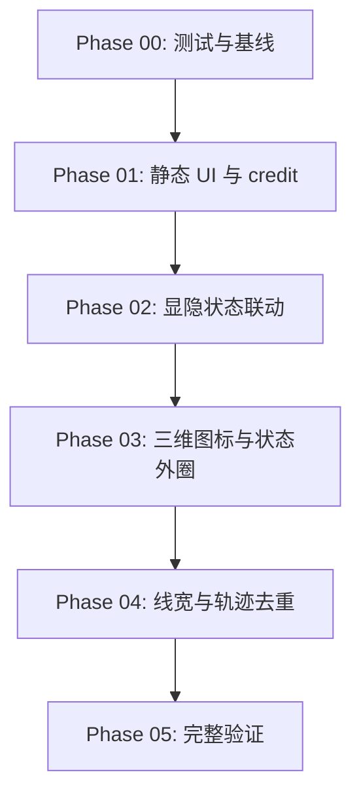

# 003 问题修复步骤索引

## 已确认决策

- 允许在项目内生成 8 个简易 GLB 几何模型，放到 `public/models/node-icons/`。
- 历史航迹线宽改为 `1`，链路线宽改为 `1`。
- “历史航迹显示”和“链路显示”默认都勾选。
- 后端仍返回但 `node_status=0` 的节点显示黑色外圈；后端不再返回的节点按当前设计移除，不额外伪造离线节点。

## 阶段索引

| 阶段 | 状态 | 目标 | 主要输出 | 依赖 |
| --- | --- | --- | --- | --- |
| Phase 00 | 已完成 | 建立回归测试和基线验证 | 当前绿色基线、后续测试调整策略 | 无 |
| Phase 01 | 已完成 | 修复页面静态 UI 与 Cesium credit | 移除标题、底栏一行、复选框、隐藏 credit | Phase 00 |
| Phase 02 | 已完成 | 实现显示状态与图例显隐联动 | 类型显隐、历史航迹开关、链路开关 | Phase 01 |
| Phase 03 | 已完成 | 实现节点图标与状态外圈 | GLB 资产、`Entity.model`、在线/离线外圈 | Phase 02 |
| Phase 04 | 已完成 | 优化线宽和历史航迹去重 | 线宽 `1`、`1e-8` 阈值去重 | Phase 03 |
| Phase 05 | 已完成 | 完整验证与交付复核 | 单测、类型检查、Playwright 截图验收 | Phase 04 |

## 依赖关系图

## 全局验收口径

- 左上角不再展示“三维态势展示”。
- 10 类节点使用不同图标语义，颜色仍来自 `nodeTypeStyle.ts` 配置，其中无人机和手持背负设备按 IP 识别。
- 节点图标尺寸约为当前视觉尺寸的 1/2。
- 节点状态外圈在线为白色，离线为黑色。
- 图例为单列，每行展示“图标 - 节点目标类型”，点击行切换该类型显隐。
- 类型显隐同时影响节点图标、该类型历史航迹，以及任一端点属于该类型的链路。
- 底部状态栏保持一行，移除手动刷新按钮，新增两个默认勾选的复选框。
- Cesium 左下角图标和文字不可见。
- 历史航迹和链路线宽均为 `1`。
- 历史航迹每节点最多保存 `historyMaxPoints` 个点，默认 `720`，经纬高变化均小于 `1e-8` 时不追加。
- 关闭历史航迹或链路显示只影响实体可见性，不清空已有历史数据。

## 待澄清事项

- 当前确认项已足够进入阶段计划和后续实现，无剩余阻塞问题。
